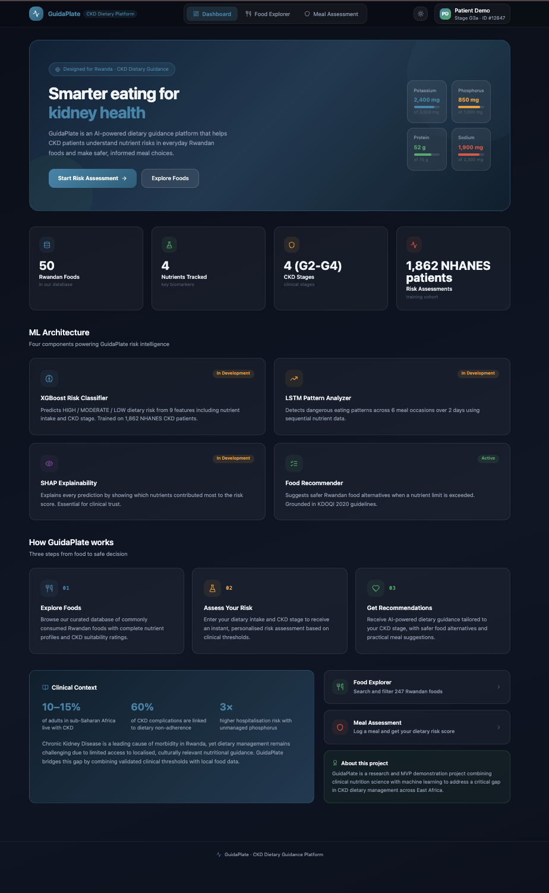
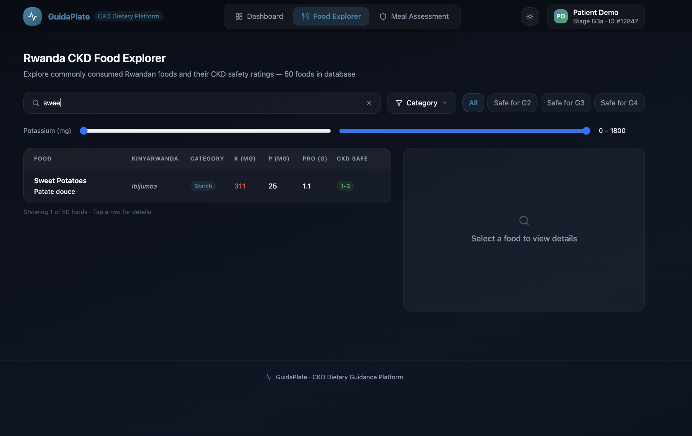
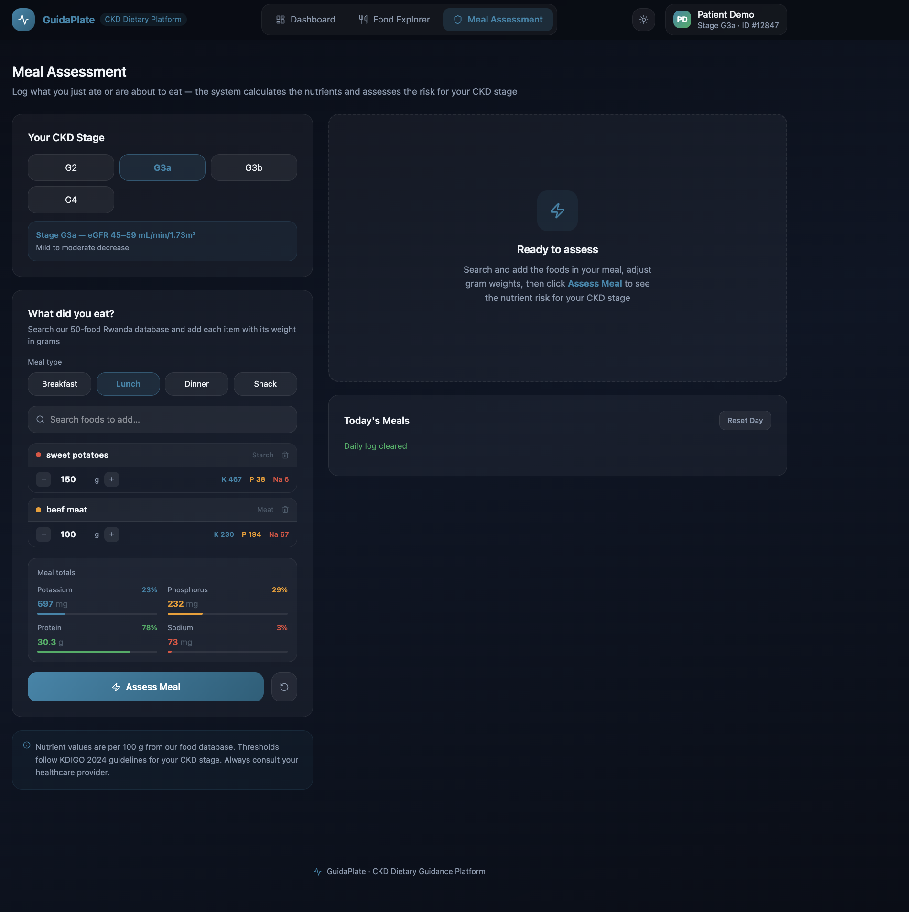
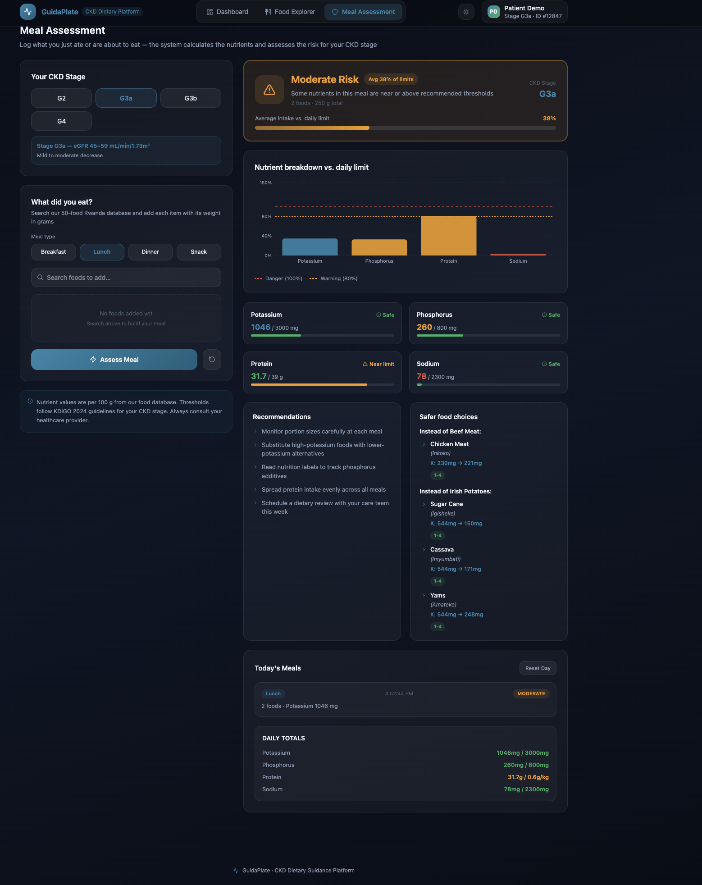
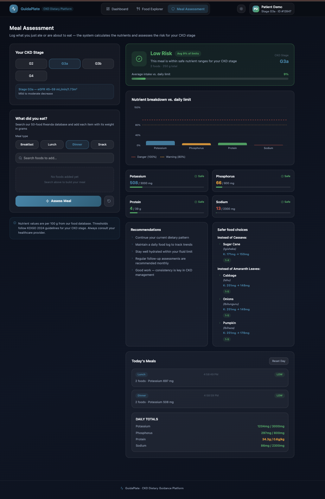
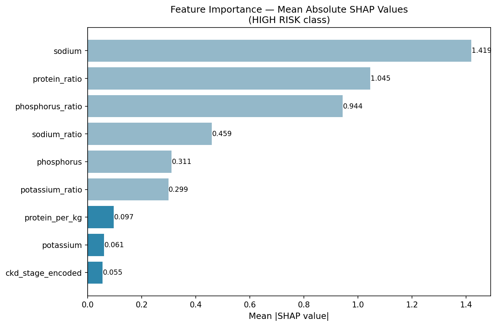

# GuidaPlate

GuidaPlate is a  project which combines a curated database of 386 foods (50 Rwanda-validated trilingual foods + 336 USDA Foundation Foods) — sourced primarily from the Kenya Food Composition Tables 2018 with USDA FoodData Central as a secondary source  statistical analysis of 1,862 NHANES CKD patients, and four trained classification/sequence models — XGBoost for daily dietary risk classification, LSTM for meal sequence pattern analysis, Supervised HMM and Unsupervised HMM for temporal pattern comparison, plus SHAP for clinical explainability  to provide stage-specific dietary guidance grounded in KDOQI 2020 and KDIGO 2024 clinical guidelines. The system targets CKD patients at stages G2 through G4 in Rwanda, where access to specialist renal dietary support remains limited, and delivers risk assessments and food substitution recommendations in English, French, and Kinyarwanda.
for CKD patients in Rwanda.

## GitHub Repository

https://github.com/Jade-Isimbi/GUIDAPLATE

## Project Status

Currently in active development.
ML models trained and evaluated.
React MVP running with 386-food database connected
(50 Rwanda-validated + 336 USDA Foundation Foods).

## What This System Does

GuidaPlate helps CKD patients in Rwanda
manage their diet safely by:

- Predicting dietary risk (HIGH/MODERATE/LOW)
- Detecting dangerous eating patterns over time
- Recommending safer Rwandan food alternatives

All recommendations are grounded in
KDOQI 2020 and KDIGO 2024 clinical guidelines.

## Tech Stack

- Backend: FastAPI (Python)
- Frontend: React (Vercel) — pending
- Database: SQLite
- ML Models: XGBoost + LSTM (TensorFlow)
- Explainability: SHAP TreeExplainer
- Food Data: Kenya FCT 2018 + USDA FDC

## Setup

### 1. Install dependencies

```bash
pip install -r requirements.txt
```

### 2. Download NHANES data

See backend/data/nhanes/README.md

### 3. Place food database

Place food_database.csv in backend/data/

### 4. Run the React demo

```bash
cd frontend
npm install
npm run dev
```

Open http://localhost:5173

### 5. Run the FastAPI backend (after running notebooks 01→08)

```bash
uvicorn backend.main:app --reload --port 8000  # run from the project root, not from inside backend/
```

API docs available at http://localhost:8000/docs

Note: FastAPI backend fully implemented with live XGBoost and
LSTM inference, 386-food recommendation engine, and SQLite
persistence.

## Project Structure

See folder structure in documentation.

## Data Sources

- NHANES 2017-2018 (CDC)
- Kenya Food Composition Tables 2018
- USDA FoodData Central
- Rwanda National Food Balance Sheet

### Food Database Composition
- **50 core foods** — Rwanda National Food Balance Sheet selection, 
  trilingual (English/French/Kinyarwanda), nutrient values from 
  Kenya FCT 2018, manually validated CKD stage safety ratings
- **336 additional foods** — USDA FoodData Central Foundation Foods 
  (whole/raw foods only), English names only, CKD stage safety 
  computed automatically from KDOQI 2020 potassium/phosphorus 
  thresholds
- **Total: 386 foods**

The original 50-food database is preserved at 
backend/data/food_database_50_original.csv for reference.

## ML Model Results

| Model | Accuracy | Precision | Recall | F1 | AUC-ROC | HIGH RISK Sensitivity |
|---|---|---|---|---|---|---|
| XGBoost v1 | 99.32% | 99.33% | 99.32% | 99.33% | 1.0 | 99.51% |
| LSTM v1 | 90.7% | 90.48% | 90.71% | 90.52% | 0.9825 ✅ | 93.6% ✅ |
| HMM (Supervised) | 63.7% | 70.4% | 63.7% | 65.7% | 0.848 | — |
| HMM (Unsupervised) | 76.8% | 73.4% | 76.8% | 74.2% | 0.843 | — |

XGBoost was tuned via RandomizedSearchCV (50 iterations, 5-fold cross-validation, optimizing weighted F1 score) across n_estimators, max_depth, learning_rate, subsample, colsample_bytree, and min_child_weight, achieving 99.32% test accuracy with the best parameters found. LSTM metrics reflect genuine learned performance on meal sequences. LSTM hyperparameters were selected via a systematic 4-configuration comparison (baseline, higher dropout, larger network, lower learning rate), with results saved to `outputs/stats/15_lstm_tuning_comparison.csv`, confirming the final architecture's performance.

Target: AUC-ROC > 0.90 ✅
Target: HIGH RISK Sensitivity > 0.85 ✅

## Statistical Analysis Results

Five tests run on 1,862 NHANES
CKD patients at α = 0.05:

| Test | Type | Result |
|---|---|---|
| Descriptive Statistics | Descriptive | Cohort characterized |
| Spearman Correlation | Inference | All 4 nutrients significant |
| Exceedance Rate Analysis | Descriptive | G4: 28% exceed K limit |
| Kruskal-Wallis | Inference | All 4 nutrients p < 0.001 |
| McNemar Test | Inference | Near-agreement — XGBoost vs rule baseline (b=2, c=0; 294/296 test cases match) |

Key finding: 66-75% of CKD patients
exceed phosphorus limits regardless
of stage. Phosphorus is the primary
dietary risk driver in the cohort.

## Reproducing ML Results

Model artifacts (xgboost_v1.pkl, lstm_final.keras) are gitignored due to file size.
To regenerate them, run the notebooks in this exact order:

### Step 1 — Build NHANES CKD cohort

```bash
jupyter notebook notebooks/01_data_exploration.ipynb
```

Output: data/processed/ckd_cohort_final.csv (1,862 patients)

### Step 2 — Run statistical analysis

```bash
jupyter notebook notebooks/03_statistical_analysis.ipynb
```

Output: outputs/stats/01-05 CSV files, outputs/figures/08-09 PNG files

### Step 3 — Train XGBoost classifier

```bash
jupyter notebook notebooks/04_xgboost_training.ipynb
```

Output: models/xgboost_v1.pkl, outputs/stats/06_xgboost_metrics.csv

### Step 4 — Train LSTM model

```bash
jupyter notebook notebooks/05_lstm_training.ipynb
```

Output: models/lstm_final.keras, models/lstm_scaler.pkl, outputs/stats/07_lstm_metrics.csv

### Step 5 — SHAP + McNemar evaluation

```bash
jupyter notebook notebooks/06_evaluation.ipynb
```

Output: outputs/figures/16-18 SHAP PNGs, outputs/stats/08-10 CSV files

### Step 6 — Expand food database (USDA)

```bash
jupyter notebook notebooks/07_usda_expansion.ipynb
```

Output: backend/data/food_database.csv (386 foods)

### Step 7 — HMM comparison

```bash
jupyter notebook notebooks/08_hmm_comparison.ipynb
```

Output: outputs/figures/19-25 HMM PNGs, outputs/stats/11-14 CSV files, outputs/stats/14_master_three_way_comparison.csv

### Python version note

Python 3.11 is required. TensorFlow crashes on Python 3.9.
Activate `venv311` before running any notebook or starting the backend:

```bash
source venv311/bin/activate
```

## Deployment Plan

### Current State

React MVP running locally
at http://localhost:5173

FastAPI backend fully implemented with live XGBoost and
LSTM inference, 386-food recommendation engine, and SQLite
persistence

### Target Architecture

Frontend: React → Vercel

Backend: FastAPI → Render

Database: SQLite (file-based)

Models: XGBoost + LSTM via
FastAPI inference endpoints

### API Endpoints (planned)

```text
GET  /api/foods
     Returns all 386 foods (50 Rwanda-validated trilingual foods + 336 USDA Foundation Foods)

POST /api/predict/risk
     XGBoost dietary risk prediction

POST /api/predict/pattern
     LSTM meal pattern analysis

GET  /api/recommendations
     KDOQI-grounded food substitutions
```

### Performance Targets — MET

AUC-ROC > 0.90:
  ✅ LSTM achieved 0.9825

HIGH RISK Sensitivity > 0.85:
  ✅ LSTM achieved 93.6%

### Timeline

June 2026: ML models + stats ✅

July Week 1-2: FastAPI + SQLite

July Week 3: React integration

July 15: Final submission

## Designs

### Live React Frontend

The GuidaPlate React frontend runs at http://localhost:5173

Built with React TypeScript, Shadcn UI, Tailwind CSS,
and Recharts.

### Dashboard



The dashboard shows the ML architecture components
(XGBoost, LSTM, SHAP, Food Recommender), key system
metrics (386 foods (50 Rwanda-validated trilingual foods + 336 USDA Foundation Foods), 4 CKD stages, 1,862 NHANES
training patients), and the three-step user journey
(Explore Foods → Assess Risk → Get Recommendations).

### Food Explorer



Browse and search 386 foods (50 Rwanda-validated trilingual foods + 336 USDA Foundation Foods) in English,
French, and Kinyarwanda. Color-coded potassium safety
ratings based on KDOQI 2020 thresholds. Detailed food
panel with nutrient bars and radar chart.

### Meal Assessment



Log foods eaten by gram weight. Select CKD stage and
enter body weight. The system calculates total nutrient
intake and classifies dietary risk as HIGH, MODERATE,
or LOW based on the patient's CKD stage and KDOQI limits.

### Risk Result with Recommendations



After assessment the system shows which nutrients are
at risk, SHAP-identified top contributing nutrient,
clinical alert if HIGH RISK confidence exceeds threshold,
and safer Rwandan food alternatives within the same
food category.

### Daily Meal Tracking



Track multiple meals across the day. Running daily totals
show cumulative nutrient intake against safe limits with
color-coded progress indicators.

### Data Visualizations

Key findings from the NHANES 2017-2018 CKD cohort analysis:





## Author

ISIMBI TUZINDE Jade Keslie

## GitHub Repo

https://github.com/Jade-Isimbi/GUIDAPLATE

## Clinical Disclaimer

GuidaPlate is a proof-of-concept
research system developed as a
BSc Software Engineering capstone
project at African Leadership University. It does not diagnose
kidney disease or prescribe
medical treatment.

All dietary suggestions are grounded
in published KDOQI 2020 and KDIGO
2024 clinical guidelines. Nutrient
values are sourced from Kenya FCT
2018 and USDA FoodData Central.

Always consult a qualified
nephrologist or registered dietitian
before making dietary changes.
