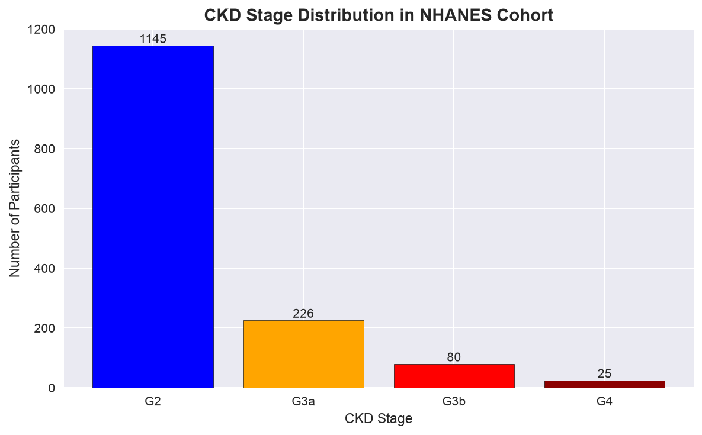
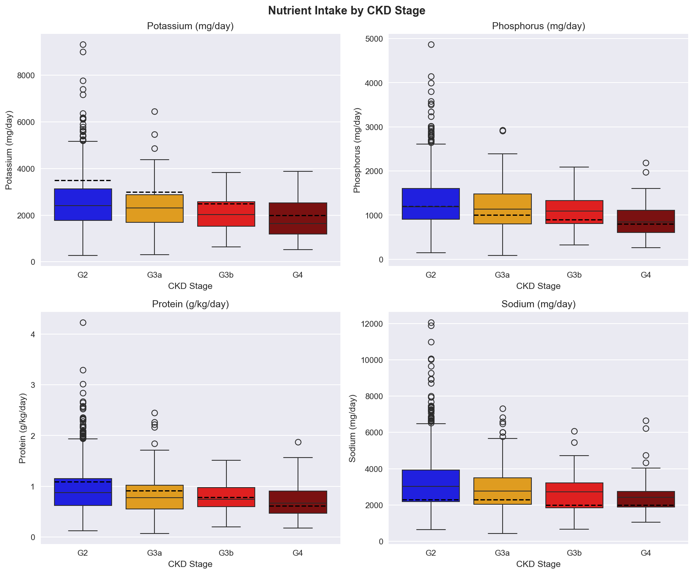
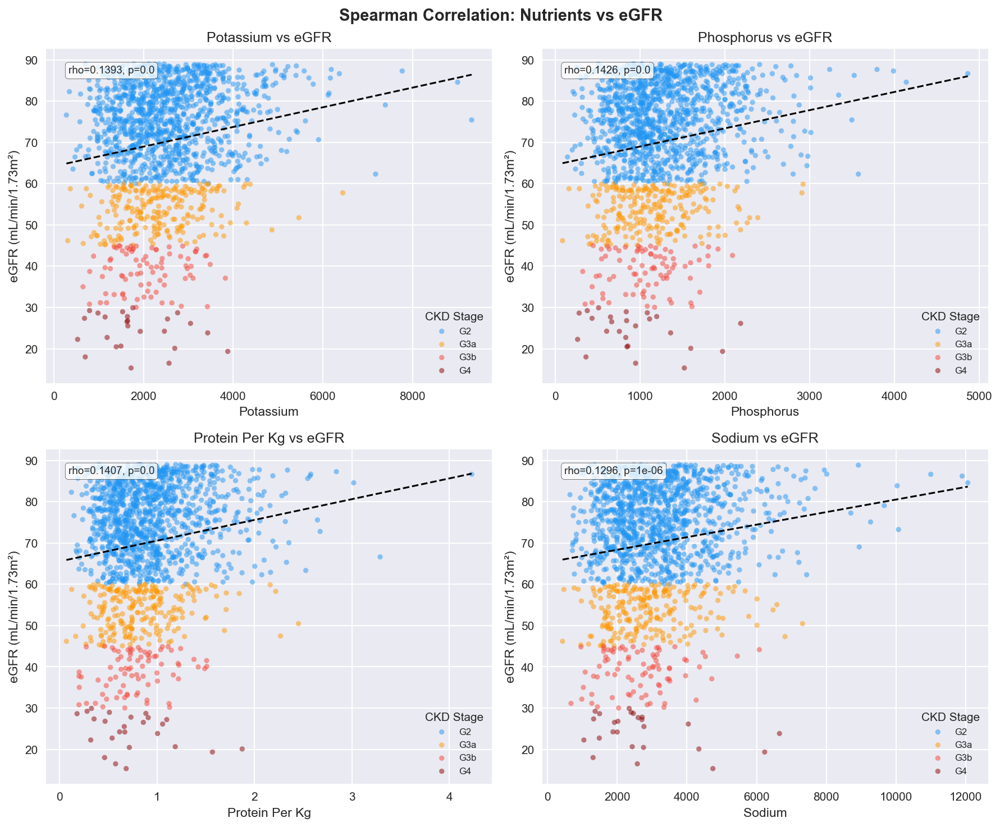
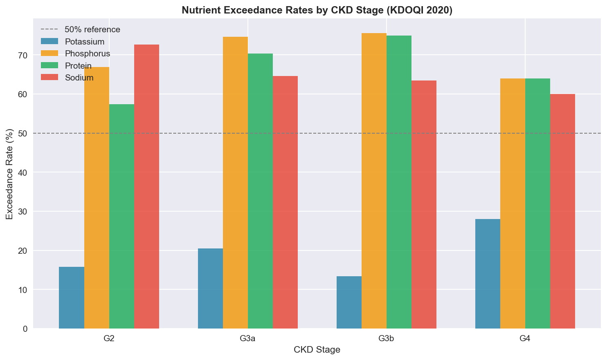

# GuidaPlate

An AI-powered dietary decision-support system
for CKD patients in Rwanda.

## GitHub Repository

https://github.com/Jade-Isimbi/GUIDAPLATE

## Project Status
Currently in active development.
ML models trained and evaluated.
React MVP running with 50-food
Rwanda database connected.

## What This System Does
GuidaPlate helps CKD patients in Rwanda
manage their diet safely by:
- Predicting dietary risk (HIGH/MODERATE/LOW)
- Detecting dangerous eating patterns over time
- Recommending safer Rwandan food alternatives

All recommendations are grounded in
KDOQI 2020 and KDIGO 2024 clinical guidelines.

## Tech Stack
- Backend: FastAPI (Python)
- Frontend: React (Vercel) — pending
- Database: SQLite
- ML Models: XGBoost + LSTM (TensorFlow)
- Explainability: SHAP TreeExplainer
- Food Data: Kenya FCT 2018 + USDA FDC

## Setup

### 1. Install dependencies
pip install -r requirements.txt

### 2. Download NHANES data
See backend/data/nhanes/README.md

### 3. Place food database
Place food_database.csv in backend/data/

### 4. Run the React demo
cd frontend
npm install
npm run dev
Open http://localhost:5173

### 5. Run the FastAPI backend (after running notebooks 01→06)
cd backend
uvicorn main:app --reload --port 8000
API docs available at http://localhost:8000/docs

Note: FastAPI backend is under
development (stubs only).
Full backend integration planned
for July 2026.

## Project Structure
See folder structure in documentation.

## Data Sources
- NHANES 2017-2018 (CDC)
- Kenya Food Composition Tables 2018
- USDA FoodData Central
- Rwanda National Food Balance Sheet

## ML Model Results

| Model | Accuracy | AUC-ROC | HIGH RISK Sensitivity |
|---|---|---|---|
| XGBoost v1 | 99.7%* | 1.000* | 100%* |
| LSTM v1 | 89.6% | 0.9818 ✅ | 93.6% ✅ |

*XGBoost metrics reflect feature-label
alignment in initial version.
LSTM metrics reflect genuine
learned performance on meal sequences.

Target: AUC-ROC > 0.90 ✅
Target: HIGH RISK Sensitivity > 0.85 ✅

## Statistical Analysis Results

Five tests run on 1,862 NHANES
CKD patients at α = 0.05:

| Test | Type | Result |
|---|---|---|
| Descriptive Statistics | Descriptive | Cohort characterized |
| Spearman Correlation | Inference | All 4 nutrients significant |
| Exceedance Rate Analysis | Descriptive | G4: 28% exceed K limit |
| Kruskal-Wallis | Inference | All 4 nutrients p < 0.001 |
| McNemar Test | Inference | Infrastructure ready |

Key finding: 66-75% of CKD patients
exceed phosphorus limits regardless
of stage. Phosphorus is the primary
dietary risk driver in the cohort.

## Reproducing ML Results

Model artifacts (xgboost_v1.pkl, lstm_final.keras) are gitignored due to file size.
To regenerate them, run the notebooks in this exact order:

### Step 1 — Build NHANES CKD cohort
jupyter notebook notebooks/01_data_exploration.ipynb
Output: data/processed/ckd_cohort_final.csv (1,862 patients)

### Step 2 — Run statistical analysis
jupyter notebook notebooks/03_statistical_analysis.ipynb
Output: outputs/stats/01-05 CSV files, outputs/figures/08-09 PNG files

### Step 3 — Train XGBoost classifier
jupyter notebook notebooks/04_xgboost_training.ipynb
Output: models/xgboost_v1.pkl, outputs/stats/06_xgboost_metrics.csv

### Step 4 — Train LSTM model
jupyter notebook notebooks/05_lstm_training.ipynb
Output: models/lstm_final.keras, models/lstm_scaler.pkl, outputs/stats/07_lstm_metrics.csv

### Step 5 — SHAP + McNemar evaluation
jupyter notebook notebooks/06_evaluation.ipynb
Output: outputs/figures/16-18 SHAP PNGs, outputs/stats/08-10 CSV files

### Python version note
Python 3.11 is required. TensorFlow crashes on Python 3.9.
Use: conda create -n guidaplate python=3.11 && conda activate guidaplate

## Deployment Plan

### Current State
React MVP running locally
at http://localhost:5173
FastAPI backend: stubs only
(full implementation July 2026)

### Target Architecture
Frontend: React → Vercel
Backend: FastAPI → Render
Database: SQLite (file-based)
Models: XGBoost + LSTM via
FastAPI inference endpoints

### API Endpoints (planned)
GET  /api/foods
     Returns all 50 Rwandan foods
POST /api/predict/risk
     XGBoost dietary risk prediction
POST /api/predict/pattern
     LSTM meal pattern analysis
GET  /api/recommendations
     KDOQI-grounded food substitutions

### Performance Targets — MET
AUC-ROC > 0.90:
  ✅ LSTM achieved 0.9818
HIGH RISK Sensitivity > 0.85:
  ✅ LSTM achieved 93.6%

### Timeline
June 2026: ML models + stats ✅
July Week 1-2: FastAPI + SQLite
July Week 3: React integration
July 15: Final submission

## Designs

### Live React Frontend
The GuidaPlate React frontend runs
at http://localhost:5173

Built with React TypeScript, Shadcn UI,
Tailwind CSS, and Recharts.

### Dashboard
**Dashboard:** The dashboard shows the ML architecture overview, 50-food database stats, and 1,862 NHANES training patients.

### Food Explorer
**Food Explorer:** Trilingual search across 50 Rwandan foods with potassium color coding and radar charts.

### Meal Assessment
**Meal Assessment:** Stage-aware meal builder with rule-based HIGH/MODERATE/LOW risk classification.

### Risk Result with Recommendations
**Risk Result:** Per-nutrient breakdown with KDOQI limit reference lines and smart food substitutions.

### Daily Meal Tracking
**Daily Tracking:** Running cumulative daily totals with color-coded progress against stage limits.

### Data Visualizations
Key findings from the NHANES CKD
cohort analysis:

## Video Demo
[Link to be added before submission]

## Author
ISIMBI TUZINDE Jade Keslie

## Clinical Disclaimer

GuidaPlate is a proof-of-concept
research system developed as a
BSc Software Engineering capstone
project at African Leadership University. It does not diagnose
kidney disease or prescribe
medical treatment.

All dietary suggestions are grounded
in published KDOQI 2020 and KDIGO
2024 clinical guidelines. Nutrient
values are sourced from Kenya FCT
2018 and USDA FoodData Central.

Always consult a qualified
nephrologist or registered dietitian
before making dietary changes.
